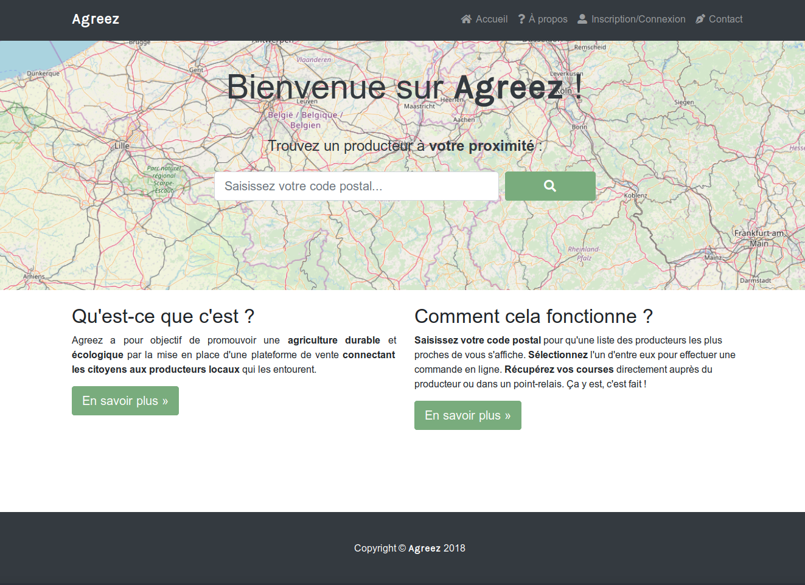
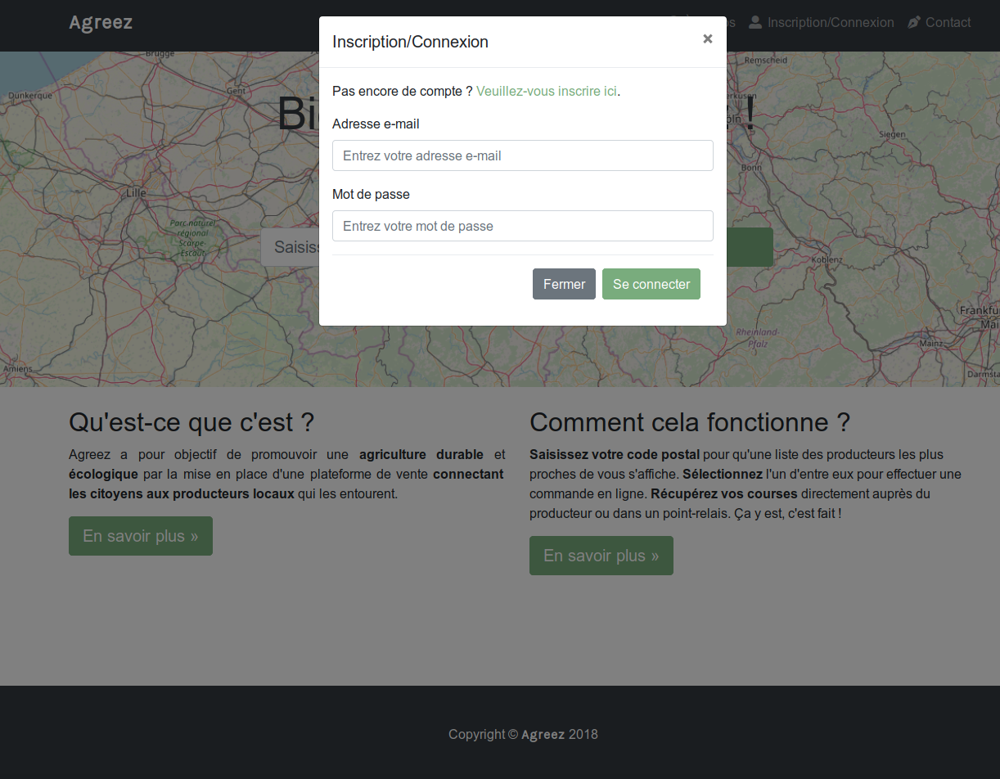
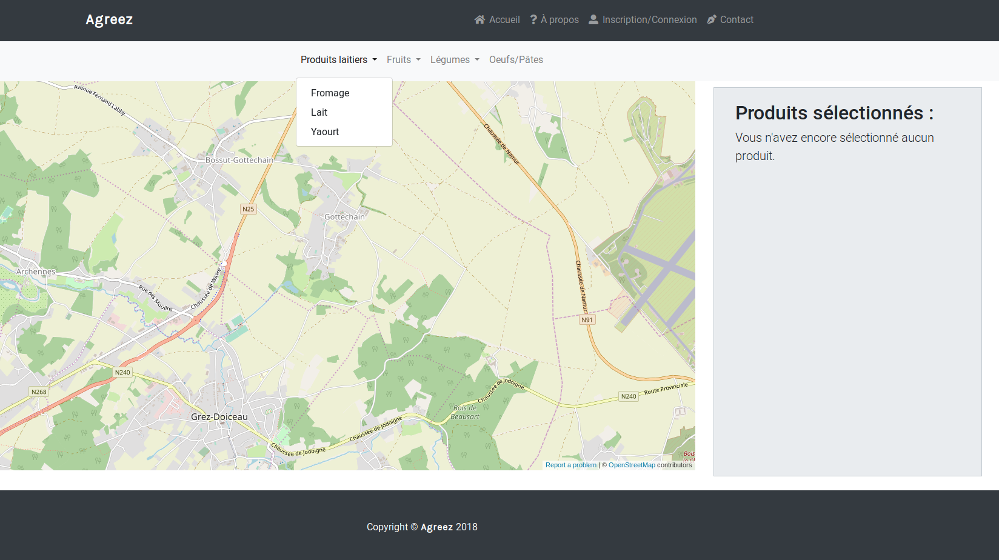
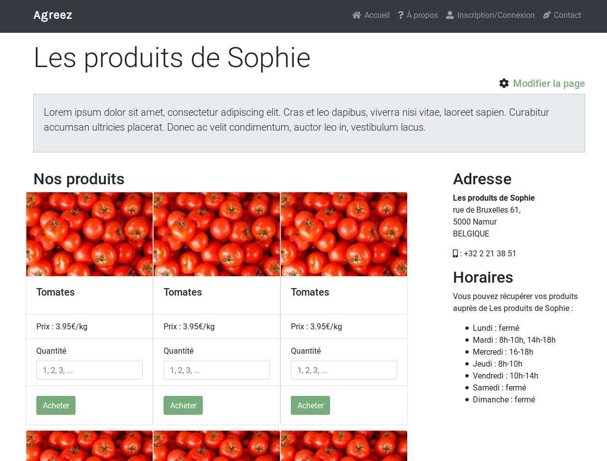

# Agreez

### CSLabs Hackathon Smart Rurality 2018

###### Antoine Bedaton, Sandis Engelen, Antoine Lallemand, Sophie Tysebaert & Dimitri Wauters

---

## Qu'est-ce que c'est ?

**Agreez** a pour objectif de promouvoir une **agriculture durable et écologique** par la mise en place d'une plateforme de vente **connectant les citoyens aux producteurs qui les entourent**.

---

## Objectif : favoriser les "circuits courts"
c'est-à-dire :

- **limiter la distance** lieu de production -> lieu de distribution ;
- **promouvoir et soutenir** l'agriculture *locale* ;
- **renouer** les contacts entre habitants

---

# Agreez a pour ambition de répondre à ces multiples facettes...
## en mettant directement en contact producteurs et citoyens

---

## Comment cela fonctionne ?

- recherche des producteurs **les plus proches** (rayon < *x* km)
- affichage des **produits disponibles chez ces producteurs**
- **itinéraire le plus court** pour récupérer ses achats...
- chez le producteur

---

## Les +

- possibilité de payer par **monnaie locale**
- réseau social (**événements**)
- recherche par produits **et recettes**
- **open source**

---

---

# Publics visés

## Les citoyens

- De la consommation vers la **consomm'action**
- **Lien social**

## Les producteurs
* Bénéficier d'une **meilleure visibilité**
* Rétribution à un prix **plus équitable**

---

## Aspects financiers $$

- **Commission** sur chaque commande effectuée pour la **maintenance du service**
- Soutiens externes (**sponsors**)

---

# Démo

---

---

---

(oui, il y a beaucoup de tomates !)

---

# Merci pour votre écoute :-)

###### Antoine Bedaton, Sandis Engelen, Antoine Lallemand, Sophie Tysebaert & Dimitri Wauters
